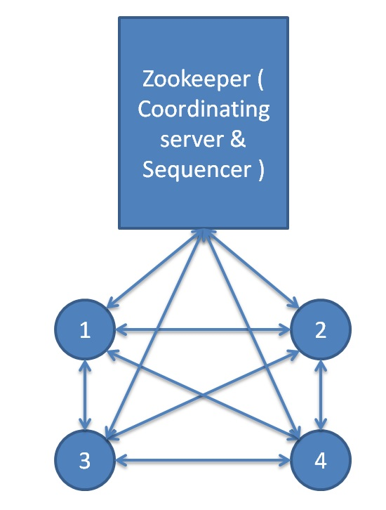

% ECE 419 - Lab 3
% Zeeshan Qureshi(997108954); Jaidep Bajwa(997808494)
% 22 Mar 2013

Design
======

Naming/Coordination/Sequencing Service
--------------------------------------

We used ZooKeeper as our fault-tolerant distributed coordination service
which also serves the naming/sequencing needs. It also supports multiple
game sessions simultaneously.

Message Queue
-------------

We use ZeroMQ which provides efficient publisher-subscriber abstractions.

Features:

  + Connection setup/teardown
  + One-Many Publishing (Fan Out)
  + Many-One Subscription (Fan In)

Algorithm
---------

  + ZooKeeper starts up and we create game rooms with seeds
  + Client connects to ZooKeeper and gets info for a game room and adds
    itself as a child node in that room with its IP:PORT.
  + The client initializes a ZeroMQ PubSub queue.
  + Client fetches a list of all players in a room and adds them to its maze.
    It also subscribes to the message queues for every other client.
  + Client sets watches on the game room and is notified by ZooKeeper if
    another client joins/disconnects.
  + Every time a client needs to send out an action, it requests ZooKeeper
    for a new sequence number and attaches it to the packet. ZooKeeper
    guarantees that the sequence numbers generated are monotonically
    increasing and contiguous.

Fault Tolerance
---------------

ZeroMQ guarantees that the message will be pushed out even when the
client dies in between. When the client crashes, ZooKeeper notifies
other clients and they remove it from their mazes and the game
continues.

\

\clearpage

Design Considerations
---------------------

**Evaluate the portion of your design that deals with starting, maintaining, and exiting a game, what are its strengths and weaknesses?**

We have used zookeeper as our coordination system:

  + Everytime a client starts, it connects with the zookeeper.
  + zookeeper creates a znode, under the root directory "/game-<id>" (createmode =  sequential,ephemeral)
  + the client sets a watch on its parent and its siblings if any
  The above mechanism is very robust and gaurantees the following
  + Whenever a player joins, all players are notified (nodechildren changed in the parent)
  + Whenever a player quits/ or looses connection, all other siblings will be notified and they update their respective maze

Weakness:

  + Do not support dynamic join.

**Evaluate your design with respect to its performance on the current
platform (i.e. ug machines in a small LAN). If applicable, you can use
the robot clients in Mazewar to measure the number of packets sent for
various time intervals and number of players. Analyze your results**

The average latency for a packet over a LAN is 0.5-2ms which is good
enough even for a very heavy algorithm. For our game, there is a
continuous ZooKeeper heartbeat that is transmitted preiodically. For
every move, there are 2 packets for generating a sequence number and $n$
packets for broadcast to other players.

**How does your current design scale for an increased number of players?
What if it is played across a higher-latency, lower-bandwidth wireless
network { high packet loss rates? What if played on a mix of mobile
devices, laptops, computers, wired/wireless?**

As we rely on packet sequence number for ordering, if a client has
higer-latency it will affect everyone in the game. Each client will
display an action associated with a packet recieved only if its sequence
number is the next one it is expecting otherwise it'll queue it for
delivery later on.

If playing on a mobile/wireless network, instead of having clients
broadcast their messages, we can push the burden onto ephemeral
distribution nodes whose only job is to multicast. That was those mobile
devices will save battery as well as other clients will see lower
latency since the ephemeral nodes will be connected via a faster
network.

We havent dealt with making "fire" action as atomic, so there is some
inconsistency. For eg: X kills another client Y and the Y is destroyed
on X's computer, but due to network delay on Y's computer it dodged the
bullet and survived.
